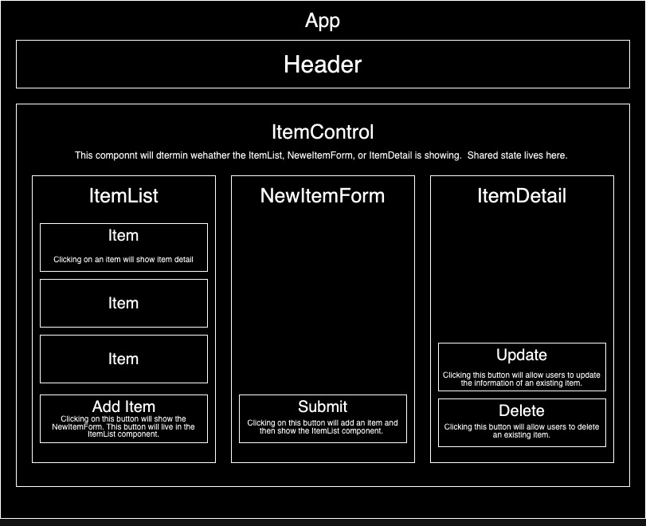

# Template Repository

#### with __tests__, coverage, jest, .env, .gitignore, lint, cleanwebpack, htmlwebpack 

#### By (Your Name Here)

## Technologies Used

* _List all_
* _the major technologies_
* _you used in your project_
* _here_

## Description

## Setup/Installation Requirements

* _This is a great place_
* _to list setup instructions_
* _in a simple_
* _easy-to-understand_
* _format_

## Known Bugs

* _Any known issues_
* _should go here_

## License

When you create your template repository, take the time to add thorough installation/setup instructions to your README. This should include information on how to run the project:

Installing all packages with $ npm install.

Building the project using webpack with $ npm run build

Starting a development server with $ npm run start

Linting JS files in the src folder with $ npm run lint

Running tests with Jest using $ npm run test

Also, make sure you update the Technologies Used section of your README, too! There's been a host of new tech that we've used in our projects in this course section.

